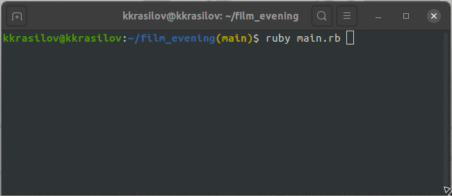

# "Фильм на вечер"

## Описание

Програма - парсер. Находит 250 лучших фильмов по версии [IMDb](https://ru.wikipedia.org/wiki/250_%D0%BB%D1%83%D1%87%D1%88%D0%B8%D1%85_%D1%84%D0%B8%D0%BB%D1%8C%D0%BC%D0%BE%D0%B2_%D0%BF%D0%BE_%D0%B2%D0%B5%D1%80%D1%81%D0%B8%D0%B8_IMDb).
По найденным фильмам программа предложит список режисеров. Вы можете выбрать любого режиссера фильм которого захотите сегодня посмотреть. Программа сама подберет для Вас идеальный фильм на вечер!

## Preview


## Установка

Для корректной работы программы на вашем компьютере должен быть установлен [Ruby MRI](https://www.ruby-lang.org/en/).

```
$ git clone https://github.com/kkrasilov/film_evening.git
$ cd ./film_evening
```

Тестирование программы

```
$ rspec
```

## Запуск

Запуск осуществляется командой

```
$ ruby main.rb
```
